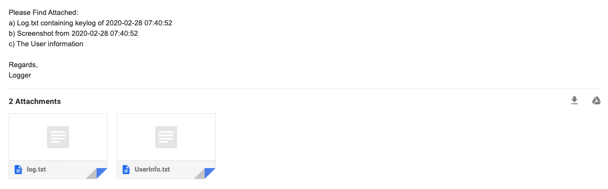

# Advanced_Keylogger
<h2 align="center"><strong>Advanced Keylogger</strong></h2>

<em>The executables for this keylogger can be downloaded from --> <a href="executables">executables folder</a></em> 
<em><strong>Not to be used on others computers without consent!</strong></em>

This advanced keylogger has the ability to:
<ol type="1">
  <li>Monitor all keystrokes (with the ability to apply spaces and backspaces to all keys recorded, forming full sentences and not unreadable letters and key definitons everywhere)</li>
  <li>Take screenshots of the screen periodically(Does not work on mac) and send it to the given email address</li>
  <li>Acquire IP location and device details of the targeted laptop/user</li>
  <li>Send the collected information through email in these files:</li>
  <li type="none">
    <ul type="circle">
      <li>log.txt --> Key log</li>
      <li>UserInfo.txt --> Users IP, Device details</li>
      <li>screenshot__datetime__.png --> One screenshot taken right before sending email</li>
    </ul>
  </li>
</ol>
 

This advanced keylogger utilizes (<em>All code in file --&gt; <a href="log.py">log.py</a></em>):

<ul type="square">
  <li>Python modeuls pynput --> listening to keystrokes</li>
  <li>Python module pscreenshot --> taking screenshot</li>
  <li>Python module smtplib, email --> sending emails</li>
  <li>Python modules time, datetime, sys, plat, getpass --> design, and simple function of executable</li>
</ul>
 
Screenshot of email sent by keylogger:

